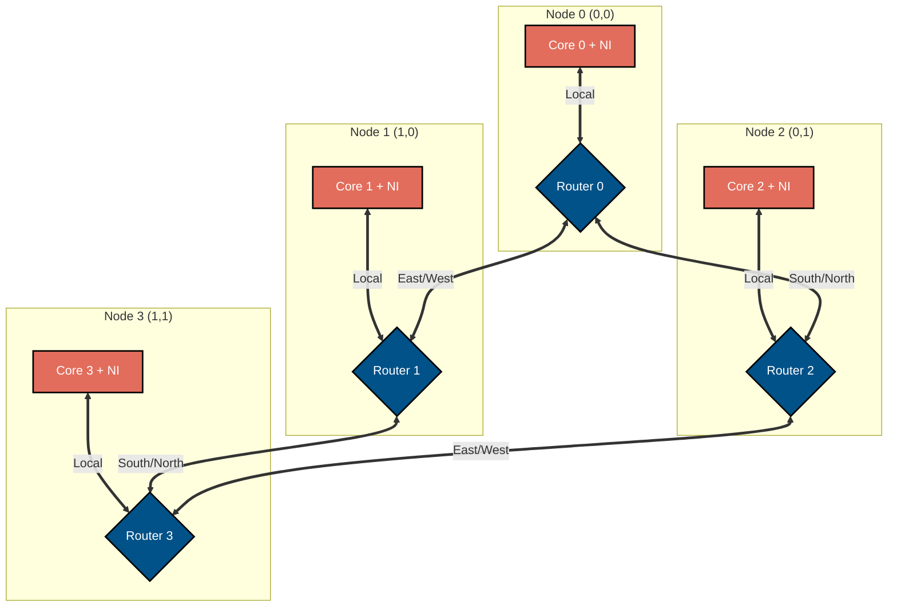
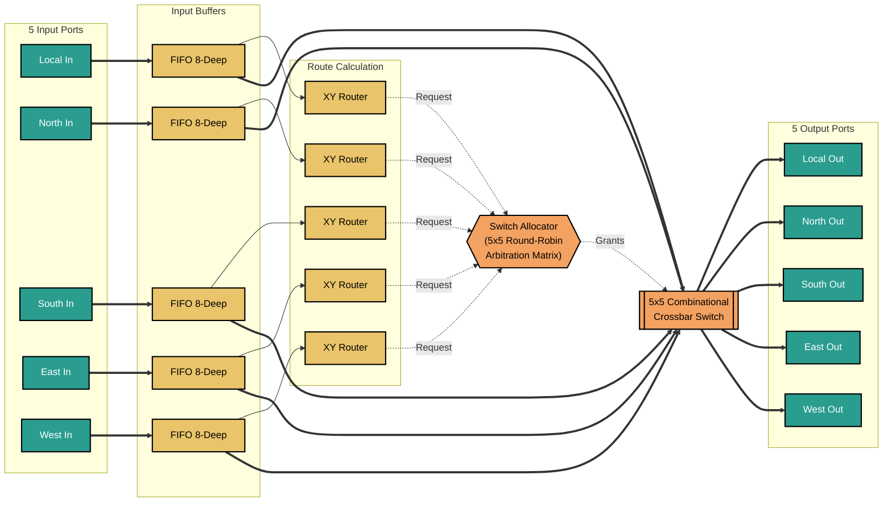

# Scalable 4-Core Mesh Network-on-Chip (NoC)


## 1. Overview
This project is a hardware-oriented, FPGA-ready implementation of a scalable Network-on-Chip (NoC) architecture. It is designed as a reusable interconnect fabric for multi-core systems, with a focus on synthesis friendliness, modularity, and measurable hardware behavior.

The primary objective is to provide a scalable interconnect fabric suitable for multi-core compute platforms, addressing the need for high-throughput, low-latency communication between custom accelerators or RISC-V cores.

- **4-core mesh NoC:** Fully parameterized 2x2 mesh topology.
- **Router design:** Dimension-Order Routing (XY routing) ensuring deadlock-free traversal.
- **Basic packetization and arbitration:** 3-flit packetization (Head, Body, Tail) with 5-way Round-Robin arbitration featuring packet-locking.
- **Latency measurement:** Hardware-level end-to-end latency timestamping and calculation.
- **Hardware Demonstration:** Integrated UART Bridge for real-time PC-to-FPGA testing and latency visualization.

---

## 2. Architecture Spec

### Top-Level Mesh Topology
The fabric utilizes a standard 2D mesh consisting of 4 nodes. Each node contains a **Network Interface (NI)** for core-level packetization and a **5-Port Router** (Local, North, South, East, West).



### Router Micro-architecture
Each router is highly modular and synthesis-ready, consisting of:
1. **Input Buffers:** 8-depth FIFOs with strict Valid/Ready flow control.
2. **XY Routing Logic:** Combinational dimension-order logic.
3. **Switch Allocator:** A 5-port matrix utilizing Round-Robin arbiters with strict packet-locking.
4. **Crossbar Switch:** A purely combinational AND-OR multiplexer matrix for latch-free data routing.



### Data Path & Packet Structure
To meet the technical expectations, the data path is strictly defined:
- **Physical Link Width:** 34 bits (1-bit X coordinate, 1-bit Y coordinate, 2-bit Flit Type, 30-bit Payload).
- **Packet Size:** 3 Flits (Head, Body, Tail).
- **Core Interface Width:** 60 bits (30-bit Body + 30-bit Tail).
- **Arithmetic Justification:** The system utilizes fixed-point bitwise operations for routing, allocation, and timestamping. Floating-point is unnecessary for NoC interconnect logic and would needlessly waste LUTs and power.

---

## 3. Functional Verification Results

The design utilizes a comprehensive SystemVerilog verification suite. Verification was performed using Xilinx Vivado.

### Test Coverage
- **Unit Tests:** FIFO wrap-around, XY path resolution, Crossbar bijection.
- **Fabric Tests:** 1-hop, multi-hop, simultaneous bijection, and severe 5-way port contention.
- **Flow Control:** Upstream backpressure (FIFO full) and downstream stalls (Core busy).

**Simulation Output:**
1. _NoC Top Module Test_

   

2. _UART Standalone Loopback Test_
   
   

3. _UART Protocol Bridge Test_
  
   

**Data Transfer Waveform:**

   

**Note:** Each design module for NoC is tested individually, covering all edge cases for the respective module. NoC testbenches are in [rtl/sim](rtl/sim). FPGA/UART wrapper-oriented testbenches are in [fpga/sim](fpga/sim).

### Repository Layout
- [rtl](rtl): synthesizable NoC RTL
- [rtl/uart](rtl/uart): shared UART/protocol blocks (`uart_tx`, `uart_rx`, `uart_cmd_parser`, `uart_resp_formatter`)
- [rtl/sim](rtl/sim): NoC and UART integration simulation testbenches
- [fpga](fpga): FPGA top wrapper and board integration files
- [fpga/constraints](fpga/constraints): XDC constraints
- [fpga/sim](fpga/sim): wrapper-level simulation benches

---

## 4. Hardware Implementation & Real-Time Capability

The design is deployed on a **Xilinx Artix-7 (xc7a100tcsg324-1)** FPGA.
To demonstrate real-time capability, a custom **UART Protocol Bridge** was integrated into Node 0.
1. The PC sends a binary payload via UART (`0xA1` to target Node 1).
2. Node 0 packetizes it and routes it across the physical FPGA fabric.
3. Node 1 extracts it, embeds its Node ID, and bounces it back.
4. Node 0 ejects the packet, calculates latency, and transmits the payload + latency back to the PC via UART.

**Hardware Test Output (HTerm)**

   https://github.com/user-attachments/assets/2d53cbb1-b452-48b2-8f13-7dbbb11c311a

_The hex output `B1 48 4F 57 00 03` confirms successful traversal from Node 0 to Node 1 and back._ 

Here is what it represents:
- `B1`: Response from Node 1
- `48 4F 57`: Payload
- `00 03`: Latency (in clock cycles)

**Note:** As the custom UART module only parses hexadecimal or binary characters, _HTerm terminal software_ is used to demonstrate communication between the 4 nodes of the Network-on-Chip.

---

## 5. Performance Metrics & Resource Utilization

### FPGA Resource Utilization

The architecture is designed for hardware efficiency, utilizing minimal logic to allow maximum area for AI/ML compute cores.
| Resource | Utilization | Available | % Used |
| -------- | ----------- | --------- | ------ |
| **LUTs** | 1,731 | 63,400 | 2.73 |
| **FFs** | 3,656 | 126,800 | 2.88 |
| **BRAM** | 0 | 135 | 0 |

   

### Power-Performance Trade-offs

**Total Power:** 0.127 W

   

Here, the purely combinational crossbar and XY routing units ensure minimal dynamic power draw by avoiding unnecessary register stages. The use of Dimension-Order Routing sacrifices some peak throughput under heavy congestion compared to adaptive routing, but significantly reduces LUT utilization and static power consumption.
**Discussion:** The purely combinational crossbar and XY routing units ensure minimal dynamic power draw by avoiding unnecessary register stages. The use of Dimension-Order Routing sacrifices some peak throughput under heavy congestion compared to adaptive routing, but significantly reduces LUT utilization and static power consumption.

### Throughput & Latency
   
   

- **Clock Frequency:** 100 MHz (Timing constraints fully met).
- **Latency:** Base 1-hop latency is 3 clock cycles (30ns).
- **Peak Throughput:** 100 million flits/sec per link (3.4 Gbps per directional port).

#### Peak Throughput Calculation

The peak throughput of the Network-on-Chip is calculated based on the physical data path width and the global clock frequency. 

**Hardware Parameters:**
* **Global Clock ($f_{clk}$):** 100 MHz ($10^8$ cycles/second)
* **Physical Link Width:** 34 bits per flit
* **Transfer Rate:** 1 flit per clock cycle per port

**Base Flit Rate (Per Port):**
Each router port can transmit one flit per clock cycle.
> $100,000,000 \text{ cycles/sec} \times 1 \text{ flit/cycle} = \mathbf{100 \text{ Million flits/sec}}$

**Raw Data Throughput (Per Port):**
To find the raw bandwidth, we multiply the flit rate by the physical width of the flit.
> $100,000,000 \text{ flits/sec} \times 34 \text{ bits/flit} = 3,400,000,000 \text{ bits/sec}$
> **= 3.4 Gbps per directional port**

**Total Fabric Bandwidth:**
In a 2x2 Mesh topology, there are 4 internal bi-directional links (8 directional wires) and 4 local injection/ejection ports connecting the processing cores. The theoretical maximum data moving through the entire fabric simultaneously is:
> $(8 \text{ Internal Links} + 4 \text{ Local Links}) \times 3.4 \text{ Gbps}$ 
> **= 40.8 Gbps Total Peak Fabric Bandwidth**

---

## 6. Scalability Roadmap 

To evolve this design into a larger production-grade interconnect, the following architectural enhancements are planned:
1. **Scalability to 8+ Cores**: Parameterize the `COORD_WIDTH` and `genvar` loops to automatically synthesize 4x4 (16 cores) or 8x8 (64 cores) topologies without modifying the underlying router micro-architecture.
2. **Quality of Service (QoS)**: Implement Virtual Channels (VCs) within the input FIFOs to prioritize critical control packets (e.g., RISC-V interrupts) over bulk data transfers (e.g., Neural Network weight streaming).
3. **Dynamic/Adaptive Routing**: Replace the static XY router with a minimal adaptive router (e.g., Turn Model or Odd-Even routing) to navigate around congested hotspots during heavy machine learning workloads.
4. **Congestion Control & Power-Aware Routing**: Implement clock-gating on unused router ports and introduce source-throttling mechanisms when downstream latency timestamps exceed a critical threshold.

---

## 7. Instructions to Run
1. Clone the repository and open it in Vivado Tcl Shell (or open Vivado GUI and use the Tcl Console).
2. Recreate the project directly from the repository script:

    ```tcl
    cd <path-to-network-on-chip>
    source create_project.tcl
    ```

3. Optional: override project name while sourcing the script:

    ```tcl
    source create_project.tcl -tclargs --project_name noc_build
    ```

4. Open the created project, then run synthesis/implementation and generate the bitstream.
5. Program the Artix-7 board from _Hardware Manager_.
6. Open HTerm Serial Terminal at `115200` Baud, configure HEX send/receive, and transmit `A1 48 4F 57` to initiate a visual ping to Node 1.
7. Observe the returned response on the receiver window and continue testing with additional packets.

**Note:** If your local folder structure differs from the original export environment used to generate [create_project.tcl](create_project.tcl), regenerate the script from your local Vivado project (or update the source paths inside the script) before sourcing.
