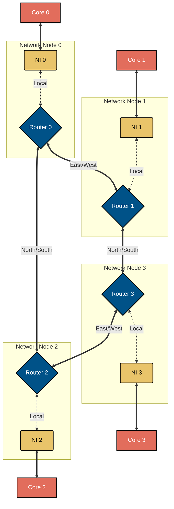
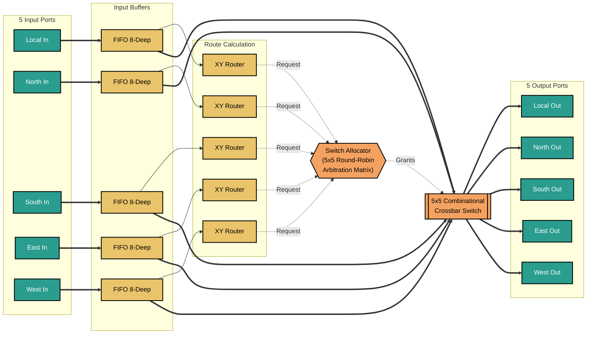

# Scalable 4-Core Network-on-Chip (NoC)


## 1. Overview
This project is a hardware-oriented, FPGA-ready implementation of a scalable Network-on-Chip (NoC) architecture. It is designed as a reusable interconnect fabric for multi-core systems, with a focus on synthesis friendliness, modularity, and measurable hardware behavior.

The primary objective is to provide a scalable interconnect fabric suitable for multi-core compute platforms, addressing the need for high-throughput, low-latency communication between high-speed custom accelerators or processor cores.

- **4-core mesh NoC:** Fully parameterized 2x2 mesh topology, can be scaled up to N-nodes by changing the parameters.
- **Router design:** Dimension-Order Routing (XY routing) ensuring deadlock-free traversal.
- **Basic packetization and arbitration:** 3-flit packetization (Head, Body, Tail) with 5-way Round-Robin arbitration featuring packet-locking.
- **Latency measurement:** Hardware-level end-to-end latency timestamping and calculation.
- **Hardware Demonstration:** Integrated UART Bridge for real-time PC-to-FPGA testing and latency visualization.

---
## 2. Repository Layout
- [rtl](rtl): synthesizable NoC RTL
- [rtl/uart](rtl/uart): UART protocol blocks (`uart_tx`, `uart_rx`, `uart_cmd_parser`, `uart_resp_formatter`)
- [rtl/sim](rtl/sim): NoC and UART integration and individual simulation testbenches
- [fpga](fpga): Python scripts and image required for tests
- [fpga/top](fpga/top): FPGA/UART top wrapper
- [fpga/constraints](fpga/constraints): XDC constraints file

---
## 3. Architecture Specifications

### Top-Level Mesh Topology
The fabric utilizes a standard 2D mesh consisting of 4 nodes. Each node contains a **Network Interface (NI)** for core-level packetization and a **5-Port Router** (with Local, North, South, East, West ports).



### Router Micro-architecture
Each router consists of:
1. **Input Buffers:** 8-depth FIFOs with strict Valid/Ready flow control.
2. **XY Routing Logic:** Combinational dimension-order logic.
3. **Switch Allocator:** A 5-port matrix utilizing Round-Robin arbiters with strict packet-locking.
4. **Crossbar Switch:** A purely combinational AND-OR multiplexer matrix for latch-free data routing.



### Data Path & Packet Structure
The data path is also parameterized with default parameters as follows:
- **Physical Link Width:** 34 bits (1-bit X coordinate, 1-bit Y coordinate, 2-bit Flit Type, 30-bit Payload).
- **Packet Size:** 3 Flits (Head, Body, Tail).
- **Core Interface Width:** 60 bits (30-bit Body + 30-bit Tail).
- **Arithmetic Justification:** The system utilizes fixed-point bitwise operations for routing, allocation, and timestamping. Floating-point is unnecessary for NoC interconnect logic and would needlessly waste LUTs and power.

---

## 4. Functional Verification Results

The design utilizes a comprehensive SystemVerilog verification suite. Verification was performed using Xilinx Vivado.

### Test Coverage
- **Unit Tests:** FIFO wrap-around, XY path resolution, Crossbar bijection.
- **Fabric Tests:** 1-hop, multi-hop, simultaneous bijection, and severe 5-way port contention.
- **Flow Control:** Upstream backpressure (FIFO full) and downstream stalls (Core busy).

### Simulation Outputs
1. _NoC Fabric Test_

    

2. _UART Standalone Loopback Test_
   
    

3. _UART Protocol Bridge Test_
  
    

**Note:** Each design module for NoC is tested individually, covering all edge cases for the respective module. NoC testbenches are in [rtl/sim](rtl/sim) directory.

---

## 5. Hardware Implementation & Real-Time Capability

The design is deployed on a **Xilinx Artix-7 (xc7a100tcsg324-1)** FPGA.
To demonstrate real-time capability, a custom **UART Protocol Bridge** is integrated with Node 0.

### Test A: UART Ping (HTerm)
1. The PC sends ASCII and binary payloads via UART (`0xAi` in binary & `Si` or `si` in ASCII targets Node `i`).
2. Node 0 packetizes payload and routes it across the physical FPGA fabric.
3. Node `i` extracts it, embeds its Node ID, and bounces it back.
4. Node 0 ejects the packet, calculates latency, and transmits the payload + latency back to the PC via UART.

**Hardware Test Output with HEX & ASCII modes (HTerm)**   

https://github.com/user-attachments/assets/b8d04f71-f63b-4fb9-8cbf-27621c76b4b4

_The hex output `B1 48 48 48 48 48 00 05` and ASCII output `[Node 1] HELLO L: 0005 cycles` confirm successful traversal from Node 0 to Node 1 and back._

Here is what it represents:
- `B1` or `[Node 1]`: Response from Node 1
- `48 48 48 48 48` or `HELLO`: Payload
- `00 05` or `L: 0005 cycles`: Latency (in clock cycles)

### Test B: 64×64 RGB Image Stream
The top-level wrapper (`top_fpga_uart_stream_noc.sv`) also embeds a **64×64 RGB image ROM** (4,096 pixels, 24-bit color). Pressing button mapped to `btn_stream` on the FPGA triggers a hardware burst that injects all 4,096 pixel packets into the NoC at maximum clock speed (100 MHz). Each packet carries a 12-bit pixel address and 24-bit RGB value. Node 3 echoes every packet back to Node 0, which serializes the recovered pixel data over UART. A Python script [uart_connect.py](fpga/uart_connect.py) reassembles the stream on the PC and renders the image using `matplotlib`.

**Hardware Test Output - 64×64 Image transferred and reconstructed**

https://github.com/user-attachments/assets/00715b36-8809-4058-86b9-ad8c675bad82

_4,096 packets streamed through the physical NoC fabric and reconstructed pixel-perfect image on the PC._

---

## 6. Performance Metrics & Resource Utilization

### FPGA Resource Utilization

The architecture is designed for hardware efficiency, utilizing minimal logic to allow maximum area for AI/ML compute cores.

Below is the resource utilization of the NoC Fabric:
| Resource | Utilization | Available | % Used |
| -------- | ----------- | --------- | ------ |
| **LUTs** | 2,063 | 63,400 | 3.25 |
| **FFs** | 4,316 | 126,800 | 3.40 |

Below is the resource utilization of Top Module containing UART + NoC:
| Resource | Utilization | Available | % Used |
| -------- | ----------- | --------- | ------ |
| **LUTs** | 3,761 | 63,400 | 5.93 |
| **FFs** | 4,719 | 126,800 | 3.72 |

### Power Analysis

**Total Power:** 0.133 W

   

Here, the purely combinational crossbar and XY routing units ensure minimal dynamic power draw by avoiding unnecessary register stages. The use of Dimension-Order Routing sacrifices some peak throughput under heavy congestion compared to adaptive routing, but significantly reduces LUT utilization and static power consumption.

### Timing Analysis

   

The timing constraints fully meet at **100 MHz clock frequency** with zero failing endpoints and +1.069 ns setup margin. Combined with the low dynamic power, these results validate that the purely combinational XY, crossbar modules are highly efficient and capable of sustaining high-speed data streams.

### Throughput & Latency

- **Latency:** Base 1-hop latency is 5 clock cycles (50ns)
- **Peak Throughput:** 40.8 Gbps

    #### Peak Throughput Calculation
    
    The peak throughput of the NoC Fabric is calculated based on the physical data path width and the global clock frequency. 
    
    **Hardware Parameters:**
    * **Clock Frequency ($f_{clk}$):** 100 MHz ($10^8$ cycles/second)
    * **Physical Link Width:** 34 bits per flit
    * **Transfer Rate:** 1 flit per clock cycle per port
    
    **Base Flit Rate (Per Port):**
    Each router port can transmit one flit per clock cycle.
    > $100,000,000 \text{ cycles/sec} \times 1 \text{ flit/cycle} = \mathbf{100 \text{ Million flits/sec}}$
    
    **Raw Data Throughput (Per Port):**
    To find the raw bandwidth, we multiply the flit rate by the physical width of the flit.
    > $100,000,000 \text{ flits/sec} \times 34 \text{ bits/flit} = 3,400,000,000 \text{ bits/sec}$
    > **= 3.4 Gbps per directional port**
    
    **Total Fabric Bandwidth:**
    In a 2x2 Mesh topology, there are 4 internal bi-directional links (8 directional wires) and 4 local injection/ejection ports connecting the processing cores. The theoretical maximum data moving through the entire fabric simultaneously is:
    > $(8 \text{ Internal Links} + 4 \text{ Local Links}) \times 3.4 \text{ Gbps}$ 
    > **= 40.8 Gbps Total Peak Fabric Bandwidth**

---
## 7. Instructions to Replicate
1. Clone the repository and open it in Vivado Tcl Shell (or open Vivado GUI and use the Tcl Console).
2. Recreate the project directly from the Tcl script:

    ```tcl
    cd <path-to-repository-root>
    source create_project.tcl
    ```
    
3. Run synthesis, implementation and generate the bitstream in the recreated project.
4. Program the Artix-7 FPGA board from _Hardware Manager_.
5. **UART Ping (Test A):** Open HTerm Serial Terminal at `115200` Baud and set the Port of your FPGA, configure HEX/ASCII send/receive, and transmit `A1 48 45 4C 4C 4F` or `S1HELLO` to initiate a visual ping to Node 1. Observe the returned response on the receiver window and continue testing with additional packets.
6. **Image Stream (Test B):** Run `python fpga/uart_connect.py` on the PC after configuring your FPGA Port (requires `pyserial`, `numpy`, `matplotlib`). Press the button mapped to `btn_stream` on the FPGA to trigger the 4096-packet image burst and observe the reconstructed image rendered on the PC.
7. To change the image, add an image in the [fpga](fpga) directory and run `python generate_mem.py <image-file-name>`, your `image_64x64_rgb.mem` will be updated. Rerun the FPGA flow, reprogram the FPGA, and execute Step 6 again.

⚠️**Note:** If your local folder structure differs from the repository structure, update the source paths inside the script [create_project.tcl](create_project.tcl) or manually add design, simulation, and constraints sources to the Vivado project.
